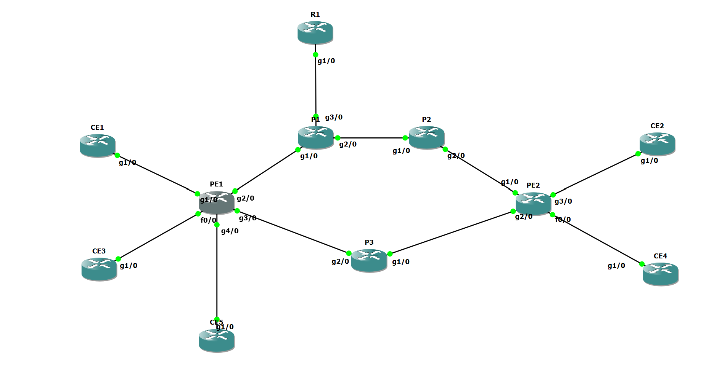
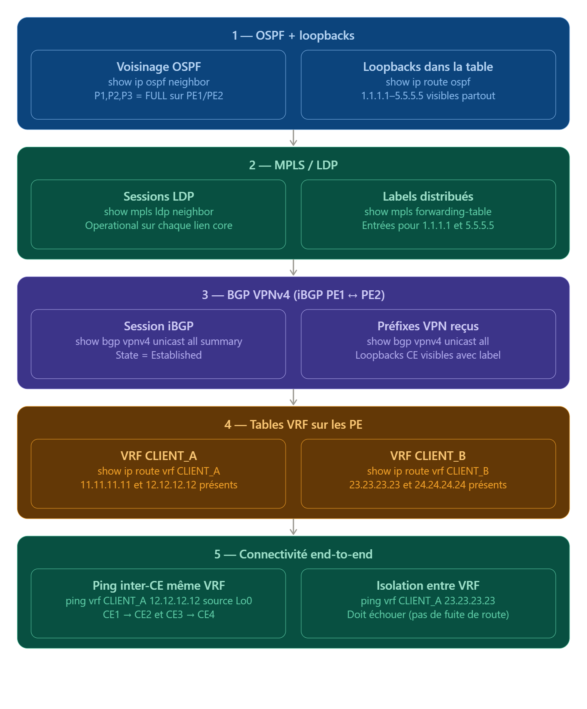

# Projet NAS - Groupe 10

## Description
Ce projet vise à automatiser le déploiement d'un réseau opérateur basé sur MPLS et BGP/MPLS VPN. 
L'infrastructure permet le transport MPLS dans le coeur du réseau, l'isolation de plusieurs clients via des VRF, l'échange de routes VPN et l'automatisation complète via un script Python.

Le projet s'appuie sur :
- un fichier d'intention réseau
- un script d'automatisation

## Topologie
Le réseau est composé de :
- Routeurs P (coeur MPLS)
- Routeurs PE (gestion des VRF et des clients)
- Routeurs CE (clients)
(- Routeur Internet INT1)

## État du projet
Implémenté : 
- OSPF dans le coeur
- MPLS + LDP
- BGP VPNv4 entre PE
- VRF + isolation clients
- eBGP PE-CE
- Automatisation du déploiement
- Tunnel MPLS TE

Expérimental mais pas dans le projet :
- Internet : configuration du routeur INT1 est partiellement définie dans le intent, l'intégration dans le routage global n'est pas terminée et n'a pas été push dans la version finale du projet.

## Tutoriel d’installation

1. Installer Python 3.11

Télécharger Python 3.11 :
https://www.python.org/downloads/release/python-3110/

Pendant l’installation, cocher "Add Python to PATH"

Vérifier :

py -3.11 --version

2. Installer les dépendances
py -3.11 -m pip install gns3fy

3. Préparer GNS3

Ouvrir structure_vide_V2.gns3 dans GNS3



5. Lancer le script

Dans le dossier automatisation :
py -3.11 config.py
  

# Commandes de test 

### Couche 1 — OSPF (sur PE1, P1, P2, P3, PE2) :

``` show ip ospf neighbor ```
``` show ip route ospf ```

Attendu : tous les routeurs core voient leurs voisins en état FULL, et les loopbacks 1.1.1.1 à 5.5.5.5 apparaissent dans la table de routage.

### Couche 2 — MPLS/LDP (sur PE1 et PE2 surtout) :

``` show mpls ldp neighbor ```
``` show mpls forwarding-table ```

Attendu : sessions LDP Operational sur chaque interface core, et des entrées de label pour les loopbacks des deux PE.

### Couche 3 — BGP VPNv4 (sur PE1 et PE2) :

``` show bgp vpnv4 unicast all summary ``` 
``` show bgp vpnv4 unicast all ``` 

Attendu : la session iBGP entre 1.1.1.1 et 5.5.5.5 est Established, et les loopbacks des 4 CE apparaissent avec un label VPN et le bon RT (65000:10 ou 65000:20).

### Couche 4 — Tables VRF (sur PE1 et PE2) :

``` show ip route vrf CLIENT_A ``` 
``` show ip route vrf CLIENT_B ``` 

Attendu : chaque PE connaît les deux loopbacks de chaque client (les siens via eBGP direct, ceux du PE distant via VPNv4).

### Couche 5 — End-to-end (depuis PE1 en mode VRF) :

``` ping vrf CLIENT_A 12.12.12.12 source Loopback0 ``` 
``` ping vrf CLIENT_B 24.24.24.24 source Loopback0 ``` 
``` ping vrf CLIENT_A 23.23.23.23 source Loopback0   ← doit échouer ``` 

Le dernier ping vérifie l'isolation : CLIENT_A ne doit pas pouvoir joindre CLIENT_B.




