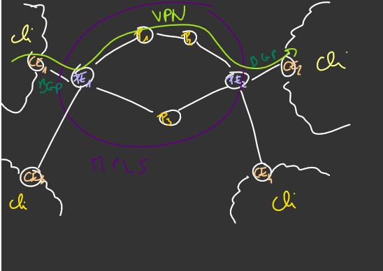

# projet_NAS

## infos qu'on a eu en cours (tp)

* conf ne peut pas être minimaliste
* **au moins** une chaîne de 4 routeurs, max **10 routeurs** apparement c'est pas mal
* implémenter le pen ultimate hop ou l'observer : donc faire en sorte d'avoir une topologie qui permet ça (d'où les 4 routeurs à la chaîne)
* on veut que le provider MPLS au milieu (avec chaîne de 4 routeurs) puisse provider un VPN à ses clients

entre 5 et 10 routeurs dont au moins 2 PE avec au moins 1 et 2 routeurs entre les deux qui font le lien , on peut en ajouter après pour exos bonus, 2 routeurs CE (customer edge) des AS clients liés aux PE BGP entre client et provider. MPLS dans AS provider. besoin d'aussi ospf

mpls ajouter label au pe entrée et enlever à l'avant dernier routeur (dernier avant PE sortie)

